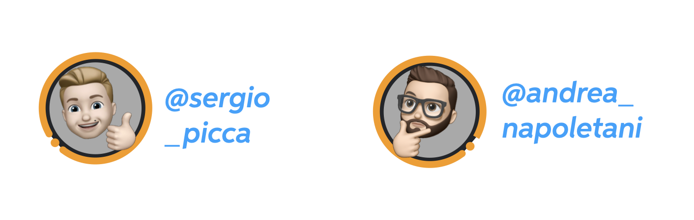

#  The team

We are two students attending the Master of Science of Engineering in Computer Science in Sapienza University of Rome and we are at our last year. We really appreciate working together and we had fun since we enjoy programming and make something that is ours, that has our blueprint. This project takes a while to be fully developed, since we tried to not leave anything to chance, but hopefully include any aspect in the big picture.



##  Team-work

Working together may be not simple, sometimes can be complex organize tasks and job, but here we based our work on collaboration and continuous support. Everyone was present to help the others with some issue or just for discuss about some idea or brand new feature to add to our application. **It was a journey, but we enjoyed the trip**. A very good experience. Anyway, let's go in more details about the **contribution of each team member**.

- **Andrea**. Andrea was our domain expert since he really likes football, so he was crucial to choose in a proper way the dataset, in order to get all important information. He developed the **Team-view** and its component and interactions.

- **Sergio**. Sergio designed the UI, building mockups and first interactions thanks to programs like AdobeXD. Furthermore, he developed the **Player-view**, its component and interactions and he strongly recommended the choice of NodeJS.

We have to say that this division was not maintained all the time, but in practice each of us collaborated in order to add functionalities to the app, so boundaries between different roles are blurred. We used the SCRUM approach during the developed of the application, with a sprint that was about of two weeks, trying to accomplish all original user stories we had.

**To learn more about us let's have a look to our LinkedIn profiles:**

- [Andrea Napoletani](https://www.linkedin.com/in/andrea-napoletani-aa0b87166/)
- [Sergio Picca](https://www.linkedin.com/in/sergio-picca-801b0b173/)

## Always need some good music

Programming is a creative process, you may have to focus, since some days are past from the old but gold ```Hello world!```. Personally we all like to listen some music when we are coding, so we would also to share one of the playlists that supported us in every development day, most important when things didn't go in the right way (most of the time). [Click here to see the playlist on Spotify](https://open.spotify.com/playlist/4wHgAEXIy9NyLt6mr9AmxX?si=3MMp1biLRrCDl5EaFvVUYQ) and enjoy.


The playlist title is purely random of course ...

Another playlist that we strongly recommend is the following, for "intense" coding sessions, enjoy!


### Customizing your jekyll website

This is the base Jekyll theme. You can find out more info about customizing your Jekyll theme, as well as basic Jekyll usage documentation at [jekyllrb.com](https://jekyllrb.com/)

You can find the source code for Minima at GitHub:
[jekyll][jekyll-organization] /
[minima](https://github.com/jekyll/minima)

You can find the source code for Jekyll at GitHub:
[jekyll][jekyll-organization] /
[jekyll](https://github.com/jekyll/jekyll)


[jekyll-organization]: https://github.com/jekyll
